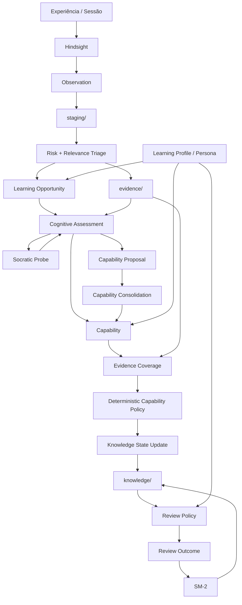

# Ontologia Cognitiva e Fundamentação Epistêmica: Persona Memory v0.3

> **Documento:** `docs/architecture/cognitive-ontology.md`  
> **Status:** Pesquisa Conceitual e Ontológica Canônica (resultado do processo extensivo de *grill-me*)  
> **Papel:** Fundamentação teórica, axiomas epistêmicos e definição ontológica dos 45 princípios conceituais do Persona Memory.

---

## 1. Visão

O `persona-memory` deve evoluir de um repositório de memória pessoal para um sistema capaz de:

- preservar evidências sobre experiências do usuário;
- identificar oportunidades de aprendizagem;
- avaliar demonstrações cognitivas sem confundir comportamento com conhecimento;
- acompanhar capacidades em diferentes contextos;
- manter um estado de conhecimento reconstruível;
- reforçar conhecimentos relevantes ao longo do tempo;
- descobrir novas oportunidades sem transformar toda observação em uma tarefa;
- permitir que o usuário governe objetivos, prioridades e mudanças relevantes no próprio perfil.

A integração com o Hindsight deve ser tratada como uma camada de observação e consolidação de padrões. Hindsight não é a autoridade do conhecimento do usuário.

Princípio epistemológico central:

```text
Observation ≠ Evidence ≠ Assessment ≠ Knowledge State ≠ Identity
```

Princípio de responsabilidade:

> **LLM observa a evidência; código observa o histórico.**

E, de forma mais ampla:

```text
LLM
→ informa, interpreta, questiona, estrutura e propõe.

Código
→ compara histórico, aplica políticas e atualiza estados de forma reproduzível.

Humano
→ governa intenção, aceita/rejeita mudanças semânticas relevantes e resolve ambiguidades estruturais.
```

---

# 2. Arquitetura conceitual



---

# 3. Entidades e responsabilidades

## 3.1 Experience

Representa o fluxo bruto de interação:

- conversa;
- código produzido;
- execução de ferramentas;
- erros;
- correções;
- explicações;
- decisões tomadas durante a sessão.

A Experience é origem de observações e evidências, mas não é Knowledge State.

---

## 3.2 Observation

Representa um padrão ou síntese produzida por Hindsight.

Exemplos:

```text
"Usuário frequentemente usa Dependency Injection para desacoplar componentes."

"Usuário costuma reformular frases em inglês para mantê-las curtas."

"Usuário passou a investigar PostgreSQL partitioning em várias sessões."
```

Uma Observation pode conter:

- statement;
- proof_count;
- distinct_session_count;
- timestamps;
- provenance;
- evidence/source references;
- confidence ou sinais fornecidos pela origem, quando disponíveis.

Observation não deve declarar:

- mastery;
- Bloom definitivo;
- identidade cognitiva;
- necessidade obrigatória de estudo;
- intervalo de revisão.

---

## 3.3 Evidence

Evidence é uma unidade auditável que pode sustentar uma avaliação futura.

Uma Evidence pode ser:

- comportamental;
- conceitual;
- procedimental;
- linguística;
- baseada em explicação;
- baseada em aplicação;
- baseada em correção de erro;
- baseada em comparação ou avaliação.

Importante:

> Uma Evidence demonstra que algo aconteceu. Ela não demonstra automaticamente que o usuário possui domínio geral do assunto.

---

## 3.4 Learning Opportunity

Representa uma oportunidade potencial de aprendizagem identificada a partir de Evidence, histórico, contexto e Learning Profile.

Pergunta principal:

> **Existe algo aqui que vale a pena aprender, consolidar, corrigir, generalizar ou verificar?**

Sinais possíveis:

- novidade;
- dificuldade;
- recorrência;
- relevância para objetivo declarado;
- relevância para necessidade inferida;
- potencial de generalização;
- lacuna aparente;
- demonstração parcial de capacidade;
- mudança de comportamento;
- conflito entre evidências.

Nenhum sinal isolado deve decidir o fluxo inteiro.

---

## 3.5 Cognitive Assessment

O Cognitive Assessment responde:

> **O que esta Evidence demonstra cognitivamente?**

O LLM recebe apenas o contexto mínimo necessário para interpretar a Evidence atual, incluindo a unidade de aprendizagem e as dimensões aplicáveis, mas não deve receber o Knowledge State histórico como fonte de orientação para sua interpretação.

Saída esperada:

```yaml
assessment:
  demonstrated:
    - capability_dimension: "autonomy"
      status: "demonstrated"

    - capability_dimension: "correctness"
      status: "demonstrated"

    - capability_dimension: "contextual_use"
      status: "not_demonstrated"

  assistance_required: false

  provisional_bloom:
    level: "apply"
    confidence: 0.74

  observations:
    - "Use was spontaneous."
    - "No correction was required."
```

O LLM não escolhe:

- maturity final;
- atualização final do Knowledge State;
- next_review;
- EF do SM-2;
- criação definitiva de Capability.

---

# 4. Bloom

Bloom deixa de ser propriedade escalar de um conceito ou de um Knowledge State.

Regra:

> **Bloom é uma propriedade da demonstração cognitiva de uma capability em uma evidência e contexto específicos.**

Portanto, não usar:

```yaml
bloom_level: apply
```

como estado global de uma Learning Unit.

Usar, por exemplo:

```yaml
provisional_bloom:
  level: apply
  basis: "produção espontânea em frase própria"
```

Uma mesma Learning Unit pode possuir demonstrações diferentes:

```text
get used to

Evidence A
→ Understand
→ explicação do significado

Evidence B
→ Apply
→ uso espontâneo em frase

Evidence C
→ Apply
→ aplicação em contexto diferente
```

Bloom pode ser inicialmente provisório e posteriormente sintetizado pelo sistema a partir do conjunto histórico de evidências.

Não usar Bloom para roteamento de memória por pasta ou como regra global de descarte. Um nível baixo pode ser relevante para aprendizagem, dependendo da Learning Profile e do domínio.

---

# 5. Learning Profile e entrevista da persona

## 5.1 Objetivo

A entrevista fornece contexto humano para aquilo que o sistema não deve inferir sozinho:

- objetivos;
- preferências;
- prioridades;
- contexto de uso;
- o que já é considerado suficiente;
- áreas que a pessoa deseja consolidar;
- áreas que a pessoa deseja explorar;
- formas de aprendizagem desejadas.

Exemplo:

```yaml
learning_profile:
  goals:
    - id: english-conversation
      domain: language
      objective: "ser compreendido em conversas"
      priority: high

  preferences:
    - "practical"
    - "contextual"

  dispositions:
    - topic: advanced-vocabulary
      status: "sufficient_for_now"
```

Não usar pesos universais como:

```text
english = 3
postgres = 5
architecture = 7
```

A prioridade é contextual e deve ser orientada pelo perfil.

---

## 5.2 Entrevista periódica

A entrevista periódica existe para recalibrar o modelo.

Ela deve:

- confirmar ou alterar objetivos;
- aceitar ou rejeitar novas prioridades;
- aceitar ou rejeitar novas dimensões de cobertura;
- aceitar ou rejeitar propostas de novas capabilities;
- marcar algo como suficiente por enquanto;
- revelar novas áreas de interesse que o comportamento sozinho não consegue interpretar corretamente.

Fluxo:

```text
Sistema detecta padrão
        ↓
Dimension / Capability Proposal
        ↓
evidências + justificativa
        ↓
usuário aceita / rejeita
        ↓
Learning Profile atualizado
```

A periodicidade exata deve ser configurável. O MVP não precisa assumir mensalidade como regra rígida.

---

# 6. Descoberta de Learning Opportunities

Uma Evidence não deve obrigatoriamente disparar Cognitive Assessment.

Primeiro existe uma etapa de triagem:

```text
Evidence
   ↓
Learning Opportunity Detection
   ↓
relevante?
   ├── não → registrar
   └── sim → continuar
```

A decisão deve combinar:

```text
Evidence
+
Learning Profile
+
contexto da sessão
+
histórico de oportunidades/evidências
```

O sistema pode descobrir uma oportunidade mesmo que o usuário nunca tenha declarado explicitamente que deseja aprender aquele assunto.

Exemplo:

```text
PostgreSQL aparece repetidamente
        ↓
Opportunity detectada
        ↓
relação com objetivo atual: baixa
        ↓
sugerida como oportunidade futura
```

A IA pode apresentar a oportunidade. O usuário decide sua importância imediata.

---

# 7. Fluxo de Staging híbrido

`staging/` é uma fronteira de ingresso, não uma fila que exige curadoria manual de 100% dos itens.

```text
Hindsight Observation
        ↓
staging/
        ↓
Risk + Relevance Triage
        ├── reject
        ├── auto-promote
        ├── human review
        └── conflict
```

## 7.1 Auto-promote

Política inicial, deliberadamente simples:

```text
proof_count >= 3
AND distinct_session_count >= 2
AND provenance completa
AND sem conflito explícito
AND não duplicada
```

Essa regra é apenas a política inicial do MVP.

`proof_count` é um sinal de recorrência, não prova de domínio.

---

## 7.2 Human review

Casos que devem ir para revisão humana:

- ambiguidade semântica relevante;
- conflito;
- provenance incompleta;
- possível mudança de crença;
- possível mudança de objetivo;
- nova capability com impacto estrutural;
- baixo grau de confiança do pipeline;
- itens que não se encaixam nas policies atuais.

---

## 7.3 Auditoria por amostragem

Itens auto-promovidos devem poder ser auditados por amostragem.

```text
auto-promoted
      ↓
amostra de auditoria
      ↓
human audit
      ↓
precision da policy
```

A curadoria humana passa a funcionar como calibração da automação.

Registrar separadamente:

```yaml
promotion_mode: auto | human | socratic
audit_status: not_sampled | sampled_pass | sampled_fail
```

---

# 8. Evidence → Cognitive Assessment

O gatilho é:

```text
Learning Opportunity relevante
        ↓
existe Evidence suficiente para inferir capacidade?
```

Há dois caminhos.

## 8.1 Evidence suficiente

Se uma nova Evidence já cobre dimensões importantes de uma Capability existente, nenhuma nova sondagem é obrigatória.

```text
Evidence
   ↓
LLM Evidence Assessment
   ↓
Capability Match
   ↓
Evidence Coverage
   ↓
Policy
   ↓
Knowledge State Update
```

Exemplo:

```text
correctness ✓
autonomy ✓
context_variation ✓ no histórico

→ atualiza estado
→ não gera Socratic Probe
```

---

## 8.2 Evidence insuficiente

Quando a observação não permite inferir adequadamente uma capacidade:

```text
Evidence
   ↓
Learning Opportunity
   ↓
Cognitive Assessment Candidate
   ↓
Socratic Probe
   ↓
Nova evidência cognitiva
   ↓
Cognitive Assessment
```

Exemplo de língua:

```text
"Você usou awkward corretamente."
```

Uma sondagem pode verificar se houve compreensão real:

> "What is the difference between an awkward situation and a difficult situation?"

Se a resposta demonstrar compreensão, o assessment registra isso.

Se a resposta revelar que a pessoa apenas repetiu uma forma aprendida, o estado deve refletir a insuficiência.

---

# 9. Capability

Capability representa:

> **uma capacidade observável que pode ser demonstrada por uma Evidence.**

Exemplos:

```text
produzir uma frase espontaneamente
comparar duas construções gramaticais
explicar uma causa
aplicar uma técnica em contexto novo
adaptar uma solução a restrições diferentes
```

Evitar capabilities excessivamente abstratas ou abrangentes.

Teste de granularidade:

> Se não conseguimos imaginar uma evidência capaz de demonstrar a capability, provavelmente ela está abstrata demais.

---

# 10. Origem de Capabilities

Capabilities podem surgir de duas fontes.

## 10.1 Entrevista

A entrevista pode definir capabilities diretamente quando o usuário descreve um objetivo claro.

```text
"Quero conseguir conversar em inglês."
        ↓
Capabilities iniciais sugeridas
```

A entrevista funciona como guia.

---

## 10.2 Descoberta por Evidence

O sistema também pode descobrir capabilities a partir do uso.

```text
Evidence
   ↓
LLM Evidence Assessment
   ↓
Capability Proposal
```

Isso é importante para escalabilidade e para descobrir áreas que o usuário não declarou inicialmente.

---

# 11. Capability Proposal e Consolidação

O LLM pode propor uma nova capability.

Ele não deve criá-la como verdade canônica imediatamente.

Fluxo:

```text
Capability Proposal
        ↓
checks determinísticos
        ↓
LLM #2: semantic consolidation
        ↓
attach | merge | create-proposal | ambiguous
        ↓
humano quando necessário
```

O LLM #2 é um **consolidador semântico**, não um juiz de verdade.

Objetivo principal:

- detectar duplicatas semânticas;
- sugerir merge;
- sugerir associação com capability existente;
- identificar granularidade ruim;
- propor nova capability quando não houver representação adequada.

Decisões ambíguas ficam pendentes de confirmação humana, preferencialmente em entrevista periódica.

---

# 12. Coverage Dimensions

Cada Capability possui dimensões que descrevem como ela pode ser observada.

Política:

```text
Capability
    ↓
dimensões necessárias
    ↓
Evidence Coverage
    ↓
regra de atualização
```

As dimensões iniciais são influenciadas pela entrevista da persona.

O sistema pode propor novas dimensões quando detectar lacunas ou padrões recorrentes.

Essas propostas não alteram automaticamente o Learning Profile.

Fluxo:

```text
Sistema detecta padrão
        ↓
Dimension Proposal
        ↓
evidências + justificativa
        ↓
usuário aceita / rejeita
        ↓
Learning Profile atualizado
```

Evitar uma árvore infinita de contextos. Contexto deve aparecer nas evidências e avaliações; a Capability deve permanecer relativamente estável.

---

# 13. Evidence Assessment versus histórico

Esta separação é obrigatória.

## LLM

Recebe:

- Evidence atual;
- contexto mínimo necessário para entendê-la;
- Learning Unit/Capability em avaliação;
- Coverage Dimensions aplicáveis.

Produz:

- dimensões demonstradas;
- dimensões não demonstradas;
- autonomia/ajuda observada;
- erros;
- gaps;
- contexto;
- provisional Bloom;
- confiança da própria interpretação.

## Código

Recebe:

- Evidence Assessment atual;
- histórico de Evidence;
- Coverage já demonstrada;
- Capability Policy;
- Learning Profile quando a policy precisar de intenção/prioridade.

Decide:

- como a cobertura muda;
- se a maturity/projeção de estado deve mudar;
- se há necessidade de nova sondagem;
- se um Knowledge State deve ser criado/atualizado;
- se um review deve ser programado.

O LLM não deve receber o Knowledge State histórico apenas para decidir se a evidência "confirma" o que já existe.

Princípio:

> **LLM observa a evidência; código observa o histórico.**

---

# 14. Knowledge State

Knowledge State representa o estado atual acompanhado pelo sistema, inclusive quando uma capability ainda é instável.

Não usar um único `bloom_level`.

Não usar uma nota universal de maturity como fonte primária.

Estrutura conceitual:

```yaml
knowledge:
  learning_unit: "get-used-to"

  capabilities:
    - id: "meaning"
      state: "demonstrated"
      covered_dimensions:
        - comprehension

    - id: "sentence-production"
      state: "developing"
      covered_dimensions:
        - production
        - autonomy
        - contextual_use
      gaps:
        - spontaneous_use_in_new_context

  evidence_refs:
    - "[[evi-001]]"
    - "[[evi-007]]"

  assessment_refs:
    - "[[assess-001]]"

  review_refs:
    - "[[review-001]]"
```

O estado deve ser reconstruível a partir de:

```text
Evidence
+
Evidence Assessments
+
Capability definitions/policies
+
Knowledge State Updates
+
Review Events
```

`knowledge/*.md` funciona como projeção materializada conveniente para leitura humana e agentes.

---

# 15. Knowledge State Update

A atualização do Knowledge State deve ser uma operação explícita.

Não atualizar o estado como efeito colateral oculto da avaliação.

Fluxo:

```text
Evidence Assessment
        ↓
Evidence Coverage
        ↓
Deterministic Policy
        ↓
Knowledge State Update
        ↓
Knowledge State
```

Cada update deve registrar o motivo da alteração.

Exemplo:

```yaml
update:
  id: "ksu-2026-10-03-001"
  learning_unit: "sentence-production"
  capability: "contextual-use"

  previous_state:
    status: "developing"

  new_state:
    status: "developing"

  change:
    added_dimensions:
      - "new_context"

  trigger:
    evidence: "[[evi-018]]"
    assessment: "[[assess-018]]"

  policy:
    id: "capability-growth-v1"

  rationale:
    - "spontaneous production"
    - "new context demonstrated"
    - "no correction required"

  created_at: "2026-10-03T..."
```

Isso permite responder posteriormente:

> Por que o estado dessa capability mudou?

---

# 16. Maturidade sem número arbitrário

A arquitetura não deve utilizar `maturity = 0.73` como estado primário.

Em vez disso, o estado é representado diretamente por:

- capacidades demonstradas;
- dimensões cobertas;
- dimensões faltantes;
- autonomia;
- consistência observada;
- variedade contextual;
- evidências;
- avaliações;
- histórico de atualizações.

Qualquer métrica quantitativa poderá ser adicionada futuramente como uma **projeção derivada** para análise, sem virar fonte canônica da verdade.

---

# 17. Diferenciar conhecimento, interesse e ação

O sistema deve separar:

```text
Knowledge State
→ o que as evidências demonstram sobre a capacidade.

Learning Profile
→ o que importa para a pessoa.

Learning Opportunity
→ o que parece valer a pena investigar.

Review Policy
→ quando vale a pena verificar novamente.
```

Exemplo:

```text
awkward
→ conhecimento observado
→ maturity/estado pode existir
→ interesse: baixo
→ prioridade: baixa
→ ação: nenhuma
```

Isso evita transformar qualquer lacuna ou oportunidade em obrigação de estudo.

---

# 18. Contexto sem árvore infinita

Conhecimento é contextual.

Uma evidência de uso de uma construção em um contexto não prova domínio geral da construção.

No entanto, o sistema não deve criar um Learning Unit separado para cada combinação contextual.

Exemplo:

```text
get used to

contextos observados:
- rotina
- experiência passada
- pergunta
```

A síntese permanece em:

```text
Learning Unit:
get used to

Capability:
contextual application

Evidence:
- routine
- past experience
- question
```

O contexto é um atributo das demonstrações, não necessariamente uma entidade da ontologia.

---

# 19. Conflitos

Conflitos devem permanecer explícitos.

Exemplo:

```yaml
conflict:
  with:
    - "[[dependency-injection]]"

  context:
    - "legacy-framework"

  status: "pending_resolution"
```

Possíveis resoluções:

```text
resolved_as_exception
resolved_as_context_change
resolved_as_evolution
resolved_as_error
```

Nem todo conflito deve gerar Socratic Probe automaticamente.

A pergunta correta é:

> Existe uma questão cognitiva que vale a pena investigar?

---

# 20. Socratic Probe

O Socratic Probe deve ser usado quando existe uma oportunidade relevante, mas a evidence disponível não fornece cobertura cognitiva suficiente.

Gatilhos principais:

1. nova capability sem evidência cognitiva suficiente;
2. gap importante;
3. conflito relevante;
4. contexto crítico ainda não demonstrado;
5. necessidade de verificar uma capacidade específica;
6. review_due do Knowledge State.

O Probe não é um exame obrigatório após cada Evidence.

---

# 21. Review e SM-2

A manutenção temporal permanece separada da avaliação cognitiva.

## 21.1 Review Eligibility Gate

SM-2 **não** serve para consolidar uma Capability. Growth (§12, §34) mede formação; SM-2 mede necessidade de revalidação temporal.

```text
Review eligibility:

SE capability.status != consolidated
ENTÃO
    não criar Review Schedule
    não inicializar SM-2

SE capability.status == consolidated
    E Review Policy determinar necessidade de revisão
ENTÃO
    criar/agendar Review
    aplicar SM-2 após Review Outcome
```

Consequência:

```text
emerging/developing
    → continuam sendo acompanhadas por Evidence + Assessment + Coverage
    → podem receber novas Opportunities e Socratic Probes
    → não possuem ciclo SM-2

consolidated
    → passa a ter elegibilidade para Review
    → Review Outcome alimenta SM-2
```

Fluxo:

```text
Cognitive Assessment
        ↓
Review Outcome
        ↓
Review Policy
        ↓
SM-2
```

O SM-2 responde principalmente:

> Quando vale a pena verificar novamente?

Não responde:

- "o usuário é bom nisso";
- "o usuário domina o conceito";
- "qual é a identidade cognitiva do usuário";
- "qual Bloom global do usuário".

A Review Policy deve ser determinística e versionada.

```yaml
review_policy_version: "v0.1"
```

A decisão da policy deve poder ser reproduzida a partir de seus inputs.

---

# 22. Review Outcome

O resultado de uma sessão de revisão deve ser registrado separadamente da avaliação e do agendamento.

Exemplo:

```yaml
review:
  id: "rev-2026-10-03-001"
  learning_unit: "past-tense-irregular-verbs"

  tested_capabilities:
    - "autonomous-production"

  outcome:
    correctness: "demonstrated"
    autonomy: "demonstrated"
    contextual_variation: "partial"

  assessment_ref: "[[assess-021]]"

  review_policy_version: "v0.1"

  scheduling:
    algorithm: "sm-2"
    previous_interval_days: 6
    next_interval_days: 13
    next_review: "2026-10-16"
```

Os detalhes exatos da fórmula devem permanecer encapsulados no motor determinístico de revisão.

---

# 23. Staging e provenance

Cada Observation importada do Hindsight deve manter provenance suficiente para reconstruir:

```text
qual observação foi recebida
qual fonte a produziu
quando foi observada
quais sessões a sustentam
qual decisão de triagem foi tomada
qual policy estava ativa
quando foi promovida/rejeitada
```

Exemplo:

```yaml
staging:
  id: "stg-2026-10-03-001"
  source: "hindsight"
  bank_id: "learner-episodic"

  observation_id: "obs-2026-10-03-004"
  proof_count: 4
  distinct_session_count: 3

  triage:
    decision: "auto_promote"
    policy_version: "triage-v0.1"

  created_at: "2026-10-03T..."
```

---

# 24. Idempotência de ingestão

O ciclo de sincronização no `SessionEnd` não deve depender do evento como única garantia de ingestão.

O sync deve possuir checkpoint/cursor/watermark.

Reexecutar:

```text
sync()
sync()
sync()
```

não deve duplicar Evidence ou staging entries.

A identidade da observação importada deve ser estável e derivável da origem sempre que possível.

---

# 25. SessionEnd / Stop

Para o MVP, o pull ao final da sessão continua sendo o ponto principal de sincronização:

```text
SessionEnd / Stop
        ↓
pull Hindsight observations
        ↓
staging
```

A arquitetura, porém, deve permitir um sync posterior por batch, para recuperar falhas de sessão ou eventos que não tenham sido capturados.

---

# 26. Estrutura do Vault

Estrutura inicial:

```text
persona-vault/
├── profile/
│   └── learning-profile.md
│
├── staging/
│   ├── observations/
│   ├── proposals/
│   ├── conflicts/
│   └── audits/
│
├── evidence/
│
├── capabilities/
│
├── knowledge/
│
├── assessments/
│
├── updates/
│
└── reviews/
```

Não é obrigatório criar todas as pastas no primeiro commit. O vertical slice pode começar com:

```text
staging/
evidence/
capabilities/
knowledge/
assessments/
updates/
```

---

# 27. Schemas mínimos

## 27.1 Staging Observation

```yaml
id: "stg-..."
source: "hindsight"
observation_id: "obs-..."
proof_count: 4
distinct_session_count: 3
created_at: "..."
triage:
  decision: "auto_promote"
  policy_version: "triage-v0.1"
```

## 27.2 Evidence

```yaml
id: "evi-..."
source_observation: "[[obs-...]]"
source_sessions:
  - "session-01"
  - "session-03"
context:
  type: "conversation"
created_at: "..."
```

## 27.3 Assessment

```yaml
id: "assess-..."
evidence: "[[evi-...]]"

capability_dimensions:
  correctness: "demonstrated"
  autonomy: "demonstrated"
  contextual_use: "not_demonstrated"

provisional_bloom:
  level: "apply"
  confidence: 0.74

assistance_required: false
```

## 27.4 Capability

```yaml
id: "sentence-production"
learning_unit: "english-conversation"

statement: "Produzir frases próprias que comuniquem a intenção desejada."

required_dimensions:
  - correctness
  - autonomy
  - contextual_variation

origin:
  type: "profile | evidence_discovery"

status: "active"
```

## 27.5 Knowledge State

```yaml
learning_unit: "english-conversation"

capabilities:
  - capability: "sentence-production"
    status: "developing"
    covered_dimensions:
      - correctness
      - autonomy
    gaps:
      - contextual_variation

last_updated: "..."
```

## 27.6 Knowledge State Update

```yaml
id: "ksu-..."
knowledge_state: "[[english-conversation]]"

trigger:
  evidence: "[[evi-...]]"
  assessment: "[[assess-...]]"

policy:
  id: "capability-growth-v0.1"

change:
  added_dimensions:
    - contextual_variation

reason:
  - "evidence demonstrated use in a new context"

created_at: "..."
```

---

# 28. MCP

Ferramentas iniciais sugeridas:

```text
sync_hindsight_observations
get_staging_queue
triage_staging
get_learning_opportunities
get_capability
get_knowledge_state
start_socratic_probe
submit_cognitive_assessment
update_knowledge_state
get_due_reviews
submit_review_outcome
run_profile_interview
```

Ferramentas devem representar operações do domínio, e não simplesmente expor manipulação arbitrária de arquivos.

---

# 29. CLI

Comandos iniciais:

```text
persona-memory staging list
persona-memory staging triage <id>
persona-memory staging reject <id>
persona-memory staging audit <id>

persona-memory opportunity list
persona-memory opportunity defer <id>

persona-memory knowledge show <learning-unit>
persona-memory review due

persona-memory profile interview
persona-memory validate
```

A nomenclatura exata pode ser ajustada conforme o código existente.

---

# 30. Vertical Slice 1: Observation → Evidence

Primeiro objetivo operacional:

```text
SessionEnd
    ↓
Hindsight
    ↓
Sync
    ↓
Staging
    ↓
Risk/Relevance Triage
    ↓
Evidence
```

Sem Cognitive Assessment e sem SM-2 obrigatórios nesta etapa.

Objetivo experimental:

> Descobrir quanto as Observations do Hindsight são realmente úteis quando submetidas às regras do Persona Memory.

Métricas:

```text
observations_imported
staging_created
auto_promoted
human_review
rejected
conflicts
duplicates
```

---

# 31. Vertical Slice 2: Evidence → Opportunity

Adicionar:

```text
Evidence
   ↓
Learning Opportunity Detection
   ↓
opportunity record
```

Objetivo:

> Medir se o sistema consegue encontrar oportunidades sem transformar tudo em estudo obrigatório.

Registrar o motivo:

```yaml
opportunity:
  signals:
    novelty: true
    difficulty: false
    goal_relevance: true
    recurrence: true
```

Esses sinais são evidências para a decisão de oportunidade, não valores universais de prioridade.

---

# 32. Vertical Slice 3: Opportunity → Assessment

Adicionar:

```text
Learning Opportunity
       ↓
assessment candidate
       ↓
Cognitive Assessment
       ↓
provisional Bloom
       ↓
Capability Match / Proposal
```

Testar três casos:

### Caso A: nova palavra

```text
Evidence:
"awkward" usado corretamente.
```

A sondagem deve verificar entendimento quando necessário.

### Caso B: construção contextual

```text
"get used to"
```

Avaliar a construção como unidade de aprendizagem e preservar diferentes contextos de uso como evidências.

### Caso C: erro corrigido

```text
"Yesterday I go..."
→ "Yesterday I went..."
```

A avaliação deve distinguir:

```text
uso correto após correção
```

de:

```text
domínio demonstrado
```

---

# 33. Vertical Slice 4: Capability Consolidation

Implementar:

```text
Capability Proposal
       ↓
deterministic checks
       ↓
LLM consolidation
       ↓
existing / merge / new proposal
       ↓
human confirmation when ambiguous
```

Objetivo:

> Evitar explosão de capabilities e manter granularidade observável.

Métricas:

```text
capability_proposals
attached
merged
rejected
human_confirmed
```

---

# 34. Vertical Slice 5: Evidence Coverage → Knowledge State Update

Implementar:

```text
Evidence Assessment
       ↓
Coverage Evaluation
       ↓
Deterministic Capability Policy
       ↓
Knowledge State Update
       ↓
Knowledge State
```

Objetivo:

> Atualizar o estado sem exigir uma nova sondagem quando a própria Evidence já cobre dimensões relevantes.

Testes:

```text
E1: corrigido pelo agente
→ cobertura parcial

E2: uso espontâneo
→ autonomia coberta

E3: uso espontâneo em contexto novo
→ contextual_variation coberta
```

Verificar que a policy produz updates previsíveis.

---

# 35. Vertical Slice 6: Review e SM-2

Somente após o fluxo Evidence → Knowledge State estar funcionando.

Implementar:

```text
Knowledge State
       ↓
review_due
       ↓
Socratic Probe / Review
       ↓
Review Outcome
       ↓
Review Policy
       ↓
SM-2
```

> **Gate (§21.1):** `review_due` só existe para capabilities `consolidated`. Capabilities `emerging`/`developing` não entram na fila de revisão — são acompanhadas por cobertura (§12, §34), não por SM-2.

Objetivo:

> verificar e reforçar conhecimentos relevantes sem misturar o mecanismo de revisão com a semântica do Knowledge State.

---

# 36. Entrevista inicial

Implementar uma entrevista curta, guiada e configurável.

Objetivos mínimos:

```text
1. O que você quer aprender ou melhorar?
2. Para que pretende usar isso?
3. O que já considera suficiente por enquanto?
4. O que quer consolidar?
5. O que não é prioridade?
6. Como prefere aprender?
```

A entrevista pode produzir propostas estruturadas para o Learning Profile, que devem ser confirmadas pelo usuário.

---

# 37. Entrevista periódica

A entrevista periódica deve ser curta e baseada no histórico recente.

Não repetir perguntas já respondidas sem motivo.

Ela pode mostrar:

```text
"Percebemos aumento de atividade em PostgreSQL.
Você quer transformar isso em área ativa de aprendizagem,
manter como interesse secundário ou apenas registrar?"
```

Também pode mostrar propostas:

```text
Nova dimensão sugerida:
"naturalness" no inglês conversacional.

Evidências:
- 8 reformulações
- 3 sessões
- relação com produção espontânea

Aceitar / rejeitar / deixar para depois
```

---

# 38. Regras de governança

## 38.1 LLM não grava Knowledge State diretamente

Toda atualização deve passar por `Knowledge State Update`.

## 38.2 LLM não decide SM-2

SM-2 permanece determinístico.

## 38.3 LLM não decide sozinho sobre novas capabilities canônicas

Capabilities novas entram como proposta até a consolidação e confirmação necessárias.

## 38.4 LLM não define identidade

Memória registra evidências sobre comportamento e conhecimento demonstrado. Não precisa declarar identidades cognitivas.

## 38.5 Rejeições são feedback

Quando uma proposta é rejeitada pelo usuário, registrar o motivo e reduzir reincidência desnecessária.

---

# 39. Métricas do sistema

## Staging

```text
observations_imported
auto_promoted
human_reviewed
rejected
conflicts
duplicates
promotion_precision
```

## Learning Opportunities

```text
opportunities_detected
opportunities_actioned
opportunities_deferred
opportunities_rejected
```

## Assessment

```text
assessments_run
socratic_probes
probes_avoided_due_to_sufficient_evidence
assessment_insufficient
```

## Capability

```text
capabilities_created
capabilities_merged
capabilities_rejected
capability_growth_events
```

## Review

```text
reviews_due
reviews_completed
review_failures
review_successes
```

---

# 40. Experimentos

## A. Qualidade da Observation

Medir a proporção de Observations do Hindsight que resultam em Evidence útil.

## B. Triage

Medir precision de auto-promoção por amostragem humana.

## C. Opportunity Detection

Medir quantidade de oportunidades relevantes versus ruído.

## D. Socratic Probe

Medir quantas sondagens realmente acrescentam informação que não existia na Evidence observada.

## E. Capability Consolidation

Medir frequência de merge versus criação de novas capabilities.

## F. Coverage Policy

Medir se a policy evita sondagens desnecessárias sem atualizar estados prematuramente.

## G. Reconstruction

Verificar se Knowledge State pode ser reconstruído a partir dos eventos históricos.

---

# 41. Auditoria e reversibilidade

Toda transformação importante deve ser rastreável:

```text
Knowledge State
    ↓
Knowledge State Update
    ↓
Assessment
    ↓
Evidence
    ↓
Observation
    ↓
Experience
```

E mudanças devem ser reversíveis:

```text
Evidence invalidated
Capability deprecated
Capability merged
Assessment superseded
Knowledge State rebuilt
```

Não sobrescrever silenciosamente interpretações anteriores.

---

# 42. O que fica fora do MVP

Não implementar inicialmente:

- modelos classificadores especializados;
- métricas sofisticadas de maturity;
- inferência forte de retenção sem evidência direta;
- árvores complexas de contextos;
- automação completa de entrevista sem confirmação humana;
- decks de flashcards como entidade central;
- mapas de conhecimento como entidade de domínio;
- ensemble de múltiplos LLMs para todas as decisões.

Modelos classificadores podem ser investigados posteriormente como componentes especializados de classificação, sem substituir as policies determinísticas.

---

# 43. Ordem recomendada de implementação

```text
1. Schemas e tipos
2. Provenance e idempotência
3. Hindsight sync
4. staging
5. deterministic triage
6. evidence
7. Learning Opportunity
8. Evidence Assessment
9. Capability + proposal
10. Capability consolidation
11. Coverage policy
12. Knowledge State Update
13. Knowledge State
14. Socratic Probe
15. Review Outcome
16. Review Policy + SM-2
17. Entrevista inicial
18. Entrevista periódica
19. Auditoria e métricas
```

A ordem deliberadamente coloca a ontologia e o histórico antes do sistema de revisão.

---

# 44. Primeiro objetivo de implementação

O primeiro ciclo funcional deve conseguir responder:

> **O que foi observado, qual evidência foi gerada, por que essa evidência foi considerada relevante, o que ela demonstrou e qual mudança o sistema decidiu aplicar ao estado?**

Um ciclo bem-sucedido é:

```text
Experience
   ↓
Observation
   ↓
Staging
   ↓
Evidence
   ↓
Learning Opportunity
   ↓
Assessment quando necessário
   ↓
Capability / Coverage
   ↓
Knowledge State Update
   ↓
Knowledge State
```

A revisão temporal entra depois:

```text
Knowledge State
   ↓
Review Policy
   ↓
SM-2
   ↓
Review
   ↓
Nova Evidence
```

---

# 45. Princípios finais

```text
Evidence before conclusion.

Observation is not knowledge.

Recurrence is not mastery.

Behavior is not necessarily cognition.

Bloom belongs to contextual demonstrations.

Context belongs in evidence, not in an infinite ontology tree.

Learning Opportunity is not the same as learning obligation.

LLM observes the evidence.

Code observes the history.

Policies determine state transitions.

Knowledge State Update is explicit and auditable.

SM-2 schedules verification, not truth.

Human intent governs objectives and meaningful profile changes.

Automation should be measured, sampled and reversible.

Knowledge State is reconstructible.

Growth forms capabilities; SM-2 only revalidates consolidated ones.
```
