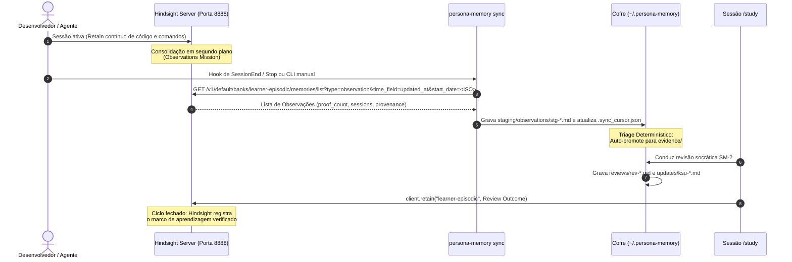

# Especificação de Integração: Hindsight Engine + Persona Memory

> **Documento:** `docs/hindsight-integration.md`  
> **Versão:** 0.3.1  
> **Status:** Consolidado com PLAN_CLAUDE.md (probe vivo 2026-10-03)

---

## 1. Visão Geral da Arquitetura de Integração

A integração entre o **Hindsight** e o **Persona Memory** adota o modelo **Cliente-Servidor Desacoplado com Ciclo Fechado Bidirecional**.

- O **Hindsight** atua como sensor de longo prazo biomimético, consolidando telemetria e interações brutas em observações probabilísticas (`Observations`).
- O **Persona Memory** atua como motor epistêmico e repositório soberano de conhecimento do usuário em Markdown/Git, aplicando políticas determinísticas de qualificação e governança temporal.



---

## 2. Configuração do Memory Bank no Hindsight

### 2.1 Identificador e Parâmetros do Banco

O banco dedicado para a trajetória do desenvolvedor é:
- **`bank_id`:** `learner-episodic`
- **`enable_observations`:** `true`

### 2.2 `observations_mission` (Briefing de Consolidação)

O parâmetro `observations_mission` substitui as regras genéricas do Hindsight, instruindo o consolidador a focar exclusivamente em padrões cognitivos e técnicos:

```text
Sintetize padrões de comportamento técnico, escolhas arquiteturais recorrentes, 
dificuldades enfrentadas, erros conceituais e heurísticas práticas aplicadas pelo desenvolvedor. 
Para cada padrão observado, registre citações exatas das falas ou trechos de código do usuário, 
o número de ocorrências empíricas (proof_count) e os identificadores de sessão distintos onde 
o comportamento se manifestou. Ignore convenções pontuais de repositórios específicos (como scripts 
de build ou variáveis de ambiente) e foque no raciocínio e competência demonstrada pelo usuário.
```

> **Nota:** Este texto é idêntico ao §2.2 do PLAN_CLAUDE.md. Alterações aqui devem ser espelhadas lá.

---

## 3. Protocolo de Sincronização Idempotente

### 3.1 O Arquivo de Cursor (`.sync_cursor.json`)

Armazenado na raiz do cofre físico (`~/.persona-memory/.sync_cursor.json`):

```json
{
  "version": 1,
  "bank_id": "learner-episodic",
  "last_synced_at": "2026-10-03T13:00:00.000Z",
  "last_observation_id": "5bd16909-efec-482d-8822-0204107c0f90",
  "synced_observations_count": 42
}
```

### 3.2 Garantia de Idempotência

1. **Chave Natural do Arquivo em Staging:**
   Todo arquivo de observação em staging possui o nome:
   `staging/observations/stg-<hindsight_observation_id>.md`
2. **Re-execuções sem Efeito Colateral:**
   Ao executar `persona-memory sync` repetidamente, se o arquivo com aquele ID já existir no cofre (seja em `staging/observations/`, `evidence/` ou `staging/conflicts/`), a importação é ignorada sem duplicar arquivos ou re-disparar triagens.
3. **Atualização Atômica do Cursor:**
   O cursor só avança após todos os arquivos do batch serem gravados com sucesso no disco.

### 3.3 Derivação de `derived_session_count`

A API Hindsight **não emite `distinct_session_count` nem `source_sessions`**. O `persona-memory` deriva:

1. Para cada `source_memory_ids[]` da observation, faz `GET /v1/default/banks/{bank}/memories/{memory_id}`
2. Coleta `document_id` distintos (cada `document_id` = uma sessão de coding agent)
3. Se `document_id` indisponível para algum, piso = `source_memory_ids.length`
4. Registra a derivação em `provenance.derivation` no staging (ex: `"document_ids distintos via GET /memories/{id} (sess-01, sess-02)"`)

> **Otimização:** Cache local LRU (TTL 24h) de `memory_id → document_id` para evitar N×M calls em syncs subsequentes.

### 3.4 Parser Defensivo para `entities`

O campo `entities` na API vem como **string vazia `""`**, não array. Parser:
- `string` → `[]`
- `array` → usa como está
- `null/undefined` → `[]`

---

## 4. O Ciclo Fechado: Retain de Feedback

Para garantir que o Hindsight não continue tratando como "dúvida ou hipótese em aberto" algo que já foi testado e consolidado pelo Persona Memory, toda sessão de revisão concluída dispara um `retain` no Hindsight:

```typescript
await hindsightClient.retain("learner-episodic", `
[COGNITIVE MILESTONE: REVIEW COMPLETED]
Learning Unit: ${learningUnit}
Tested Capability: ${capabilityId}
Demonstrated Bloom Level: ${bloomLevel}
Evaluation Rubric: Accuracy=${accuracy}/5, Autonomy=${autonomy}/5, Depth=${depth}/5
Final Grade: q=${gradeQ}/5
Result: ${gradeQ >= 3 ? "SUCCESS - Interval extended to " + nextInterval + " days" : "LAPSE - Interval reset to 1 day"}
Next Review Due: ${nextReviewDate}
Evidence Reference: ${evidencePath}
`.trim(), {
  context: "persona-memory-sm2-review",
  metadata: {
    source: "persona-memory",
    review_id: reviewId,
    learning_unit: learningUnit,
    grade_q: gradeQ
  }
});
```

> **Fail-open (v0.1):** Se o `retain` falhar (rede, Hindsight down), grava `hindsight_retained: false` no `rev-*.md` e retenta no próximo `sync`. **Nunca** faz rollback do review.

---

## 5. Variáveis de Ambiente e Configuração

| Variável | Descrição | Padrão |
| :--- | :--- | :--- |
| `HINDSIGHT_API_URL` | URL base do servidor Hindsight | `http://localhost:8888` |
| `HINDSIGHT_API_TOKEN` | Token secreto de autenticação da API (quando habilitado) | `""` |
| `HINDSIGHT_BANK_ID` | Identificador do banco de aprendizagem | `learner-episodic` |
| `PERSONA_MEMORY_VAULT` | Caminho absoluto do cofre Markdown | `~/.persona-memory` |
| `PERSONA_MEMORY_PRODUCER` | Identificador do agente produtor de mutações | `persona-memory/0.3` |

> **Precedência:** CLI flag > env var > default. Config file (`~/.config/persona-memory/config.toml`) planejado para v0.4.

---

## 6. Integração com Hooks dos Agentes de Código

### Antigravity (`~/.gemini/config/hooks.json`)
```json
{
  "hooks": {
    "Stop": [
      {
        "name": "persona-memory-sync",
        "command": "persona-memory sync --quiet"
      }
    ]
  }
}
```

### Claude Code (`~/.claude/settings.json`)
```json
{
  "hooks": {
    "SessionEnd": [
      {
        "name": "persona-memory-sync",
        "command": "persona-memory sync --quiet"
      }
    ]
  }
}
```

---

## 7. Contrato Real da API Hindsight (v0.10.2 — congelado 2026-10-03)

### 7.1 Endpoints

| Operação | Método + path | Body / query |
| :--- | :--- | :--- |
| Criar/atualizar bank | `PUT /v1/default/banks/{bank_id}` | `{"enable_observations": true, "observations_mission": "..."}` |
| Retain | `POST /v1/default/banks/{bank_id}/memories` | `{"items":[{content, document_id, context?, metadata?, tags?}]}` → `{success, items_count, usage{}}` |
| **Pull observations** | `GET /v1/default/banks/{bank_id}/memories/list?type=observation&time_field=updated_at&start_date=<ISO>&limit=&offset=` | → `{items[], total, limit, offset}`. **Sem `/list` retorna `405`.** |
| Resolver memória-fonte | `GET /v1/default/banks/{bank_id}/memories/{memory_id}` | → memória com `document_id` (sessão) |
| Versão/features | `GET /version` | `{api_version, features{observations, ...}}` |

### 7.2 Shape real de 1 observation

```json
{
  "id": "5bd16909-efec-482d-8822-0204107c0f90",
  "text": "Prefere injetar dependências como repositório e serviço via interface/parâmetro de construtor...",
  "fact_type": "observation",
  "document_id": null,
  "mentioned_at": "2026-10-03T16:39:35.619713+00:00",
  "entities": "",
  "proof_count": 2,
  "tags": [],
  "metadata": {},
  "state": "valid",
  "updated_at": "2026-10-03T16:40:14.075065+00:00",
  "source_memory_ids": ["c3a4e3c4-...", "51cbe767-..."]
}
```

### 7.3 Divergências vs. plano original (decisões congeladas)

1. **Sem `distinct_session_count`, `source_sessions`, `citations`.** Sessões derivadas via `GET /memories/{id}` → `document_id` distintos; fallback = `source_memory_ids.length`. Registrado em `provenance.derivation`.
2. **`document_id` da observation é `null`** — nunca usar como sessão.
3. **`entities` é string (vazia), não array** — parser defensivo.
4. **Cursor** `.sync_cursor.json` com `last_observation_id` = UUID; watermark = `updated_at` da última observation do batch.
5. **`opportunities/` top-level**, não em `staging/`.
6. **Milestone do ciclo fechado** com `context: "persona-memory-sm2-review"` + `metadata{source, review_id, learning_unit, grade_q}` — fail-open com `hindsight_retained: false` + retry no próximo sync.